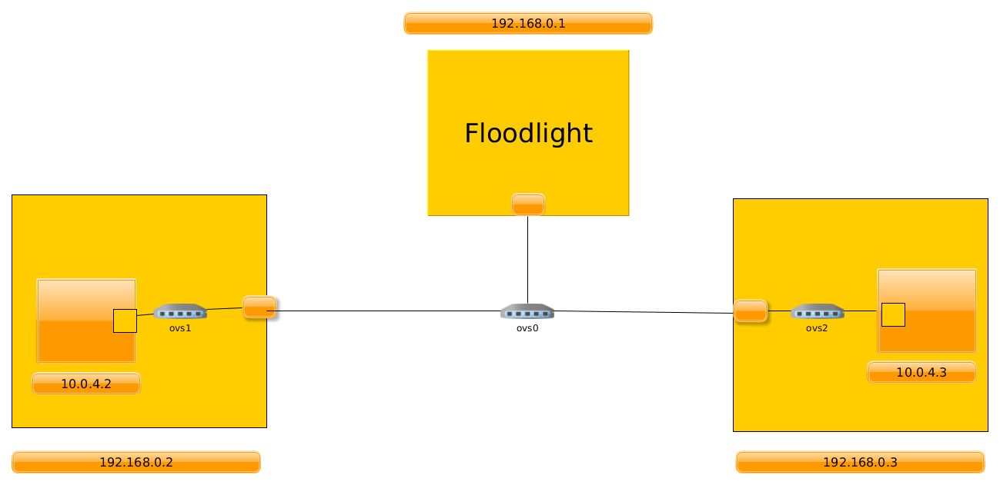

# SDN Cloud Setup Using LXC, OVS and Floodlight

## LXC Setup

In this section we would setup a lxc container named vm1. It's IP address would
be 10.0.4.2 and we would assume that we have a OVS switch interface named
ovs0. We would create the priviliged container itself so, every command assumes
root access.

### LXC Installation

```
sudo apt-get install lxc
```

### Creating a new container

```
sudo lxc-create -t download -n vm0
```

### Network configuration a container

Configuration file for vm0 container would be: /var/lib/lxc/vm0/config

Let's say we have an OVS switch with name ovs0. Then to simply configure a
container to connect to that bridge with container ip 10.0.4.2 would be:

```
lxc.net.0.type = veth
lxc.net.0.link = ovs0
lxc.net.0.hwaddr = 00:16:3e:d6:42:9c # Provided by default
lxc.net.0.ipv4.address = 10.0.4.2/24
```

This lines should be placed at last of file.

### LXC internet setup

We can't get internet working on LXC with it being connected with normal OVS
easily. Instead, lxc provides a special service for it called lxc-net.

To start the lxc-net service:

```
sudo systemctl start lxc-net
```

Once this service is started it gives us a virtual network interface called
lxcbr0. We would connect lxc to this link instead of ovs0 for internet connection.

Why we need internet connection? Because there would be nested LXCs. The
outer LXC would work as physical machine, whereas inner LXC would work as
VM. To install software stack on outer LXC, we need internet setup.

To connect our vm0 container to lxcbr0, the network config in
/var/lib/lxc/vm0/config would look like:

```
lxc.net.0.type = veth
lxc.net.0.link = lxcbr0
lxc.net.0.hwaddr = 00:16:3e:d6:42:9c # Provided by default
lxc.net.0.ipv4.address = 10.0.4.2
```

### Starting and using LXC

Now we know, how to configure lxc to connect with any bridge named ovs0 or to
configure lxc for internet connection, we now need to use LXC.

To start lxc:

```
sudo lxc-start -n vm0
```

To attach to lxc vm0's shell:

```
sudo lxc-attach -n vm0
```

This lxc-attach would give you a shell in our container vm0.

### Stopping LXC

Ofcourse you can exit from vm0's shell with exit command. However, this
just disattaches your session from vm0's shell. vm0 is still up and running.
To stop vm0:
```
sudo lxc-stop -n vm0
```

### Destroying LXC

Let's say you don't need a container anymore and you want to remove it from
disk, so just you need to do:

```
sudo lxc-destroy -n vm0
```

### Conclusion

These steps provide enough ways to interact with LXC for cloud setup. We would
use these steps further during cloud setup.

## OVS Setup

With LXC we can emulate physical machine, and we get virtual machines. The
next thing we need for a SDN cloud setup is a OpenFlow switch. We would OVS
for emulating physical openflow swithches as well as virtual switches.

### Installing OVS

```
sudo apt install openvswitch-switch
```

### Starting OVS

We need to start ovs service, to create virtual switches.

```
sudo ovs-ctl start
```

### Creating OVS bridge

In this example we would create a OVS bridge named ovs0. Now, this bridge
would act like an openflow switch, which would work as normal switch if
any SDN controller is not attached to it.

```
sudo ovs-vsctl add-br ovs0
```

### Connecting to controller

We have openflow switches, but they are dumb switches. To make our network a
SDN network we need to connect them to controller. For our example purposes we
asume that we have a controller running at IP address: 192.168.0.1 and port
6653.

```
sudo ovs-vsctl set-controller ovs0 tcp:192.168.0.1:6653
```

### Listing OVS Flow rules

We may need to take a look at flow rules installed currently on any ovs bridge
for experiment.

```
sudo ovs-ofctl show ovs0
```

### Remove OVS bridge

After experiment is done, we may want to remove the bridge created:

```
sudo ovs-vsctl del-br ovs0
```

## Setting up Floodlight controller

Now, we have physical machines, VMs, physical openflow switches and virtual
openflow switches configuration mechanism. The last thing in minimal
SDN network needs to be the SDN controller. We would use Floodlight controller
for our purposes.

### Installation

The installation and things are better explained on the official websites, so I
would link them. However, few things need to be take care of:

- We need Oracle Java 8 to be installed and set default on machine. Any other
java version would not work. Oracle Java 8 is now not available in apt
repository. So, I would link the guide to install it:
[Install Java 8](https://www.fosstechnix.com/install-oracle-java-8-on-ubuntu-20-04/)

- Floodlight installation guide: [Floodlight installation guide](https://floodlight.atlassian.net/wiki/spaces/floodlightcontroller/pages/1343544/Installation+Guide)

### Running floodlight

From floodlight's root installation directory run:

```
java -jar target/floodlight.jar
```

This command starts floodlight with default modules loaded that we need for
this experiment. It starts floodlight on current machine/container on port 6653.

## Setting up cloud

We are using this topology for cloud setup:



Now, this topology emulates 3 physical machines and 2 VMs.

Three physical machines have IP address: 

192.168.0.1/24 -> Server running SDN controller
192.168.0.2/24 -> Physical server 1
192.168.0.3/24 -> Physical server 2

These 3 physical machines are connected to one physical openflow switch ovs0.

Physical machine 1 and Physical machine 2 have 1 VM install each. Those
VM's have IP address:

VM on physical server 1 : 10.0.4.2
VM on physical server 2 : 10.0.4.3

These VM's are connected with virtual openflow switch ovs1 and ovs2 respectivly.

### Installing softwares

We need to install lxc and ovs on our actual machine. Install them using
installing instructions provided in above sections.

### Services needed to be started on host machines

lxc-net and ovs-ctl should be started on physical machines. See above section
for how to start them.

### Creating Physical machines

We would create 3 lxc containers named phy1, phy2 and cntr.

cntr would run the controller.
phy1 and phy2 would contains the VMs.

```
sudo lxc-create -t download -n phy1
sudo lxc-create -t download -n phy2
sudo lxc-create -t download -n cntr
```

### Creating Physical Openflow switch

We would have one physical switch named ovs0.

```
sudo ovs-vsctl add-br ovs0
```

### Network configuration of physical machines for internet

In network configuration, we are configuring our physical machines with IP
addresses. We would not connect them with ovs0 for now instead we would connect
to lxcbr0, because we need internet connection to install software stack
on physical machines.

For phy1:

```
lxc.net.0.type = veth
lxc.net.0.link = lxcbr0
lxc.net.0.ipv4.address = 192.168.0.2/24
```

For phy2:

```
lxc.net.0.type = veth
lxc.net.0.link = lxcbr0
lxc.net.0.ipv4.address = 192.168.0.3/24
```

For cnt:

```
lxc.net.0.type = veth
lxc.net.0.link = lxcbr0
lxc.net.0.ipv4.address = 192.168.0.1/24
```

### Installing controller on cnt

Start and attach to cnt's shell. (See above sections for details)

Now, in cnt's shell:

- Install Floodlight

Now, exit from cnt's shell.

### Installing VMs and virtual switch on phy1

Start and attach to phy1's shell.

Now, in phy1's shell:

Install lxc, ovs

Create LXC with name vm1:

```
lxc-create -t download -n vm1
```

Create ovs-switch with name ovs1:

```
sudo ovs-vsctl add-br ovs1
```

Now, configure vm1 with these configurations:

```
lxc.net.0.type = veth
lxc.net.0.link = ovs1
lxc.net.0.ipv4.address = 10.0.4.2/24
```

These configurations indicate that vm1 will have IP address 10.0.4.2 and
would be connecting to ovs1 switch when started.

Now, just exit from phy1's shell and stop the phy1 container.

### Installing VMs and virutal switch to phy2

Start and attach to phy2's shell.

Now, in phy2's shell:

Install lxc, ovs

Create LXC with name vm2:

```
lxc-create -t download -n vm2
```

Create ovs-switch with name ovs2:

```
sudo ovs-vsctl add-br ovs2
```

Now, configure vm2 with these configurations:

```
lxc.net.0.type = veth
lxc.net.0.link = ovs2
lxc.net.0.ipv4.address = 10.0.4.3/24
```

These configurations indicate that vm2 will have IP address 10.0.4.3 and
would be connecting to ovs2 switch when started.

Now, just exit from phy2's shell and stop the phy2 container.

### Connecting physical machines to Physical switch

Now, we would connect our physical machines to OVS switch ovs0 instead of
lxcbr0 because we don't need internet connection. So, network configuration
of physical machine lxc's would be:

For phy1:

```
lxc.net.0.type = veth
lxc.net.0.link = ovs0
lxc.net.0.ipv4.address = 192.168.0.2/24
```

For phy2:

```
lxc.net.0.type = veth
lxc.net.0.link = ovs0
lxc.net.0.ipv4.address = 192.168.0.3/24
```

For cnt:

```
lxc.net.0.type = veth
lxc.net.0.link = ovs0
lxc.net.0.ipv4.address = 192.168.0.1/24
```

Start the 3 physical machines. Now, all three physical machines are connected
switch ovs0.

### Starting controller

Our ovs0 is setup to connect to controller at 192.168.0.1 that is our
cnt physical machine IP address. However, cnt's doesn't have controller
running yet, so we need to do that.

Attach to cnt's shell and start the floodlight controller. Now, exit
from cnt's shell.

Now, we have controller running and ovs0 connected to it.

### Making connections in phy1

We need to connect our vm1 to ovs1. We have already done the configuration
so, we just need to start vm1.

Till this point, vm1 is connected to ovs1 but ovs1 doesn't have controller
configuration set. It needs to be controller by controller so that VM
traffic can be routed through SDN network.

```
ovs-vsctl set-controller ovs1 tcp:192.168.0.1:6653
```

Now, ovs1 is configured for SDN controller running at cnt. However, at this
point there is no way for traffic through ovs1 to reach cnt. For this
we need to connect it ovs1 to physical network. So, we connect, phy1's
eth0 interface to ovs1.

```
ovs-vsctl add-port ovs1 eth0
```

Now, ovs1 is connected to eth0 and eth0 is connected to cnt through ovs0.
We have all connections ready.

Exit from phy1 shell.

### Making connections in phy2

We need to connect our vm2 to ovs2. We have already done the configuration
so, we just need to start vm2.

Till this point, vm2 is connected to ovs2 but ovs2 doesn't have controller
configuration set. It needs to be controller by controller so that VM
traffic can be routed through SDN network.

```
ovs-vsctl set-controller ovs2 tcp:192.168.0.1:6653
```

Now, ovs2 is configured for SDN controller running at cnt. However, at this
point there is no way for traffic through ovs2 to reach cnt. For this
we need to connect it ovs2 to physical network. So, we connect, phy2's
eth0 interface to ovs2.

```
ovs-vsctl add-port ovs2 eth0
```

Now, ovs2 is connected to eth0 and eth0 is connected to cnt through ovs0.
We have all connections ready.

Exit from phy2 shell.

### Connection analysis

ovs0 is controller by SDN controller at cnt. So, this connection is
non-openflow connection.

phy1 and phy2 connection with ovs0 are openflow
connections.

On phy1:

- ovs1 and eth0 are openflow connection
- ovs1 and vm1 are openflow connection
- There is a tunneled non-openflow connection between ovs1 and cnt that goes
through physical conenction of ovs0 and phy1 and ovs0 and cnt.
This non-openflow connection is through which ovs1 communicates with
controller.

On phy2:

- ovs2 and eth0 are openflow connection
- ovs2 and vm2 are openflow connection
- There is a tunneled non-openflow connection between ovs2 and cnt that goes
through physical conenction of ovs0 and phy2 and ovs0 and cnt.
This non-openflow connection is through which ovs2 communicates with
controller.

### Testing the setup

- Attach to phy1's shell.
- In phy1's shell, attach to vm1's shell and ping 10.0.4.3. We are pinging
VM on different physical machine. And the ping works!!!

We have successfully deployed a SDN cloud using LXC and OVS. This setup works
great for experiment and research purposes. The emulated physical machines and
physical switches can be replaced with real machines and real OpenFlow switch.
lxcbr0 is through which we got connected to internet. This can be an ethernet
cable connected to a internet connected router.

### Analysis of ping

10.0.4.2 sends a packet destined for 10.0.4.3. This packet reaches ovs1. Now,
ovs1 doesn't have any flow rules installed for it. Thus, it sends the packet
to controller. Controller network is a tunneled non-openflow network over
a openflow network. ovs1 thus in reality sends the packet trough eth0 through
which it transfers to ovs0 and where it is sent to controller.
Controller installs the rules to ovs1 using the same reverse path and makes
the OFPacketOut to flood through all interface of ovs1. Due to this flooding,
the packet actually reaches ovs0 where it also doesn't know what to do with it.
Hence it sends the packet to controller again and controller installs rules
for it and orders it to flood again. It thus reaches ovs2 and again it takes
order from controller and flood packet and reaches 10.0.4.3.

When 10.0.4.3 gets the ping packet, it replies. It reaches ovs2. This
time it has flow rules installed and hence it sends it to eth0 through which
it reaches ovs0 and thus through ovs1 to 10.0.4.2.

So, one amazing thing was how, this virtual ovs1 to cnt non-openflow connection
is tunneled over ovs0 and cnt's openflow connection and ovs0 and phy1 connection. And we get the packet flow transparently.

To see the flow rules installed on 3 switches:
```
ovs-ofctl show ovs0
ovs-ofctl show ovs1
ovs-ofctl show ovs2
```
